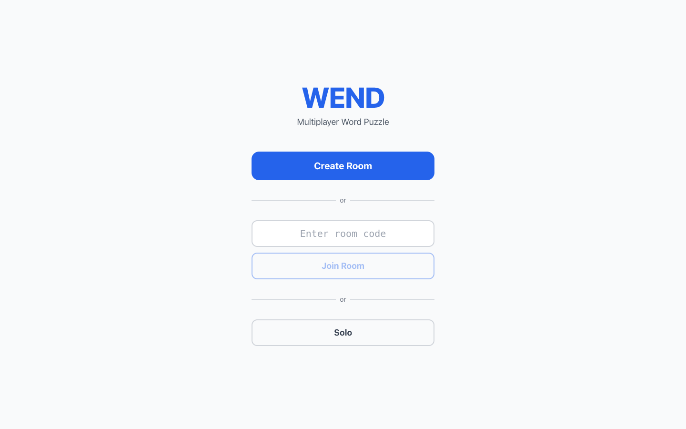
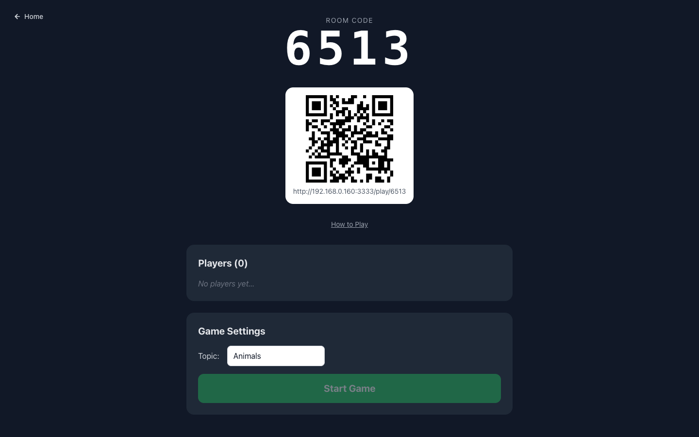
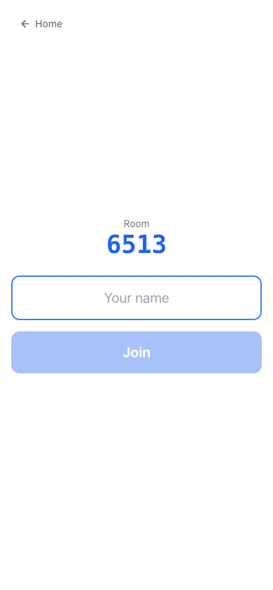
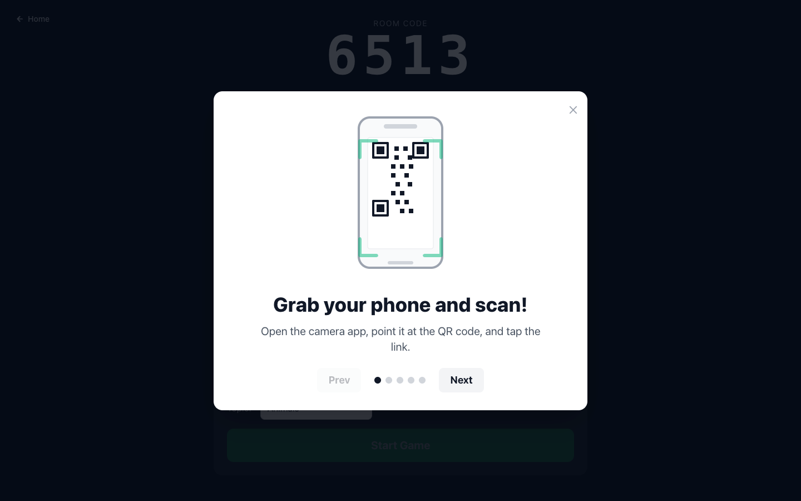
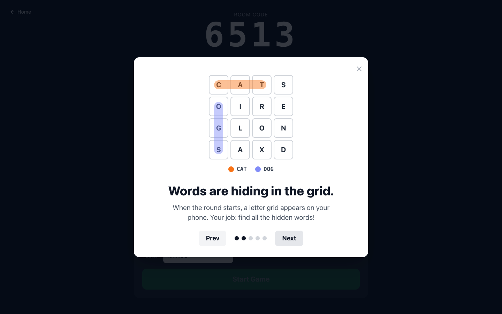

# WEND — Multiplayer Word Puzzle Game

A real-time multiplayer word puzzle game. A host runs a room on a shared screen; players solve on their phones. Each round a letter grid is generated from a topic's word list and players race independently to trace all the words. Fastest total time across 3 rounds wins.

## Screenshots

| Home | Host Lobby | Player Join |
|---|---|---|
|  |  |  |

| How to Play — step 1 | How to Play — step 2 |
|---|---|
|  |  |

## How to Play

- The host creates a room and types any topic (e.g. "Space", "Pokemon", "Kitchen")
- Players join from their phones by scanning the QR code or entering the 4-digit room code
- Each round: a letter grid appears on the host screen first (5s preview), then goes live on all phones
- Players trace words by connecting adjacent letters — horizontally or vertically, no diagonals
- Your timer runs from the moment the board goes live; finish all words as fast as possible
- Lowest total time across all 3 rounds wins

## Tech Stack

| Layer | Technology |
|---|---|
| Backend | Python (FastAPI + python-socketio), port **8888** |
| Frontend | Next.js 14 App Router + Tailwind CSS, port **3333** |
| Word generation | Groq API (`llama-3.3-70b-versatile`) |
| State | In-memory — no database |

## Running Locally

```bash
# Backend (requires uv)
cd backend && uv run python main.py

# Frontend (localhost only)
cd frontend && npm install && npm run dev

# Frontend (LAN — lets phones on the same Wi-Fi join)
cd frontend && npm run dev:lan
```

`npm run dev:lan` auto-detects your current LAN IP, writes `frontend/.env.local`, and starts the dev server. Use this whenever you want to test with real phones — no manual IP configuration needed.

Host view: `http://localhost:3333`
Backend API: `http://localhost:8888`

### Environment Variables

**Backend** — create `backend/.env.dev`:

```
PORT=8888
HOST=127.0.0.1
GROQ_API_KEY=your_key_here
```

Get a free API key at [console.groq.com](https://console.groq.com). The free tier allows 14,400 requests/day — well beyond any realistic game session volume.

**Frontend** — `frontend/.env.local` is written automatically by `npm run dev:lan`. If running `npm run dev` (localhost only), no env file is needed.

## Word Generation

When a host starts a round, the backend prompts Groq's `llama-3.3-70b-versatile` model to generate a word list for the topic. Words are validated and filtered before use:

| Rule | Detail |
|---|---|
| 3–8 letters | Shorter or longer words are filtered out |
| Alpha only | No digits, hyphens, or symbols |
| No proper nouns | Enforced by the prompt |
| Single words only | No phrases |
| 6 words per board | 10 candidates requested; prefix pairs dropped; 6 taken |
| Mix of lengths | Prompt requires at least 3 short words (3–4 letters) |
| No prefix pairs | If word A is a prefix of word B, A is dropped (e.g. POKE when POKEMON is present) |

If fewer than 6 valid words remain after filtering, the player sees an error and can try a different topic.

## Board Generation

The board is a sparse rectangular grid where each word occupies a contiguous orthogonally-adjacent path and no two words share a cell. Generation uses a randomised backtracking algorithm with a **two-pass strategy**:

1. **Strict pass (750ms):** Tries to place all words such that each word has exactly one valid traceable path on the board. This prevents a player from accidentally tracing a word via an unintended route.
2. **Relaxed pass (750ms fallback):** If the strict pass times out, a second attempt runs without the uniqueness constraint. Words are still placed in non-overlapping cells — a valid board is always produced.

Each word's canonical cell path is included in the board response so the frontend can validate that traces follow the intended path exactly.

## Project Structure

```
.
├── backend/
│   ├── main.py             # App entry point
│   └── src/
│       ├── controllers/    # Business logic: topics.py, words.py, board.py, health.py
│       ├── routes/         # FastAPI routers: /topics, /board, /health
│       ├── socket/         # Socket.io event handlers (events.py)
│       └── middleware/     # Daily request cap (daily_cap.py)
├── frontend/src/
│   ├── app/host/[code]     # Host view — QR, lobby, board, timer
│   ├── app/play/[code]     # Player view — board, word tracer
│   ├── app/solo/           # Solo mode — single player, any topic
│   ├── hooks/              # useRoom.ts, useSocket.ts
│   └── lib/types.ts        # Shared types
└── docs/                   # Architecture, WebSocket events, game design, topics
```

## Docs

See the [`docs/`](./docs/) folder for:
- Architecture overview
- WebSocket event reference
- Game design spec
- Topic and word generation guide
