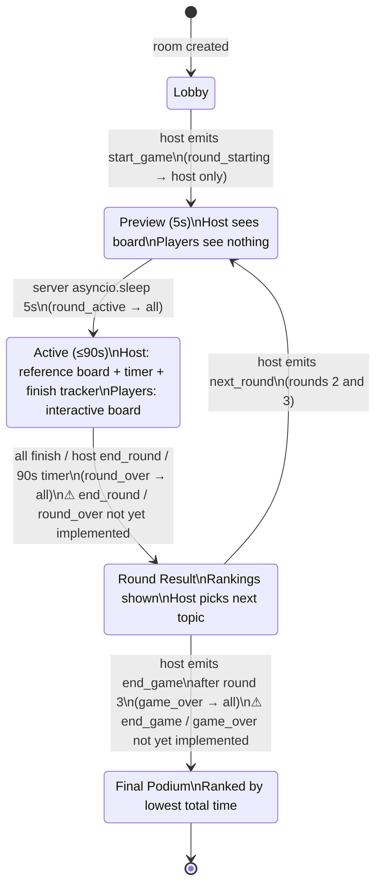
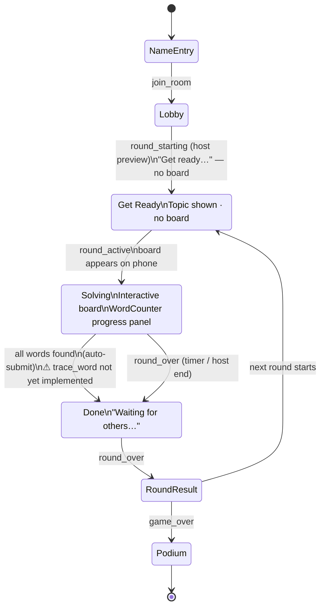
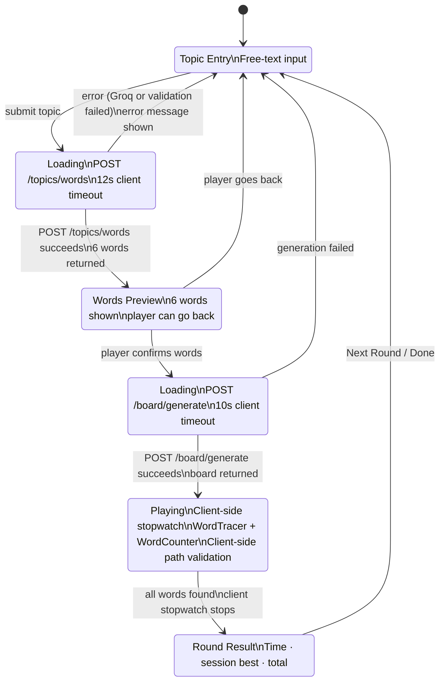
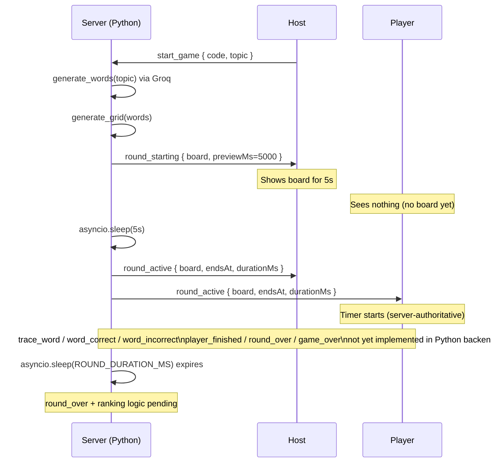

# Game Flow — State Machine

## Host Phase Machine

## Player Phase Machine

Note: A player can also be kicked from the lobby before the game starts. The kicked player's client detects `player_kicked` with `playerId === socket.id` and redirects home.

## Solo Mode Phase Machine

## Round Timer & Scoring

