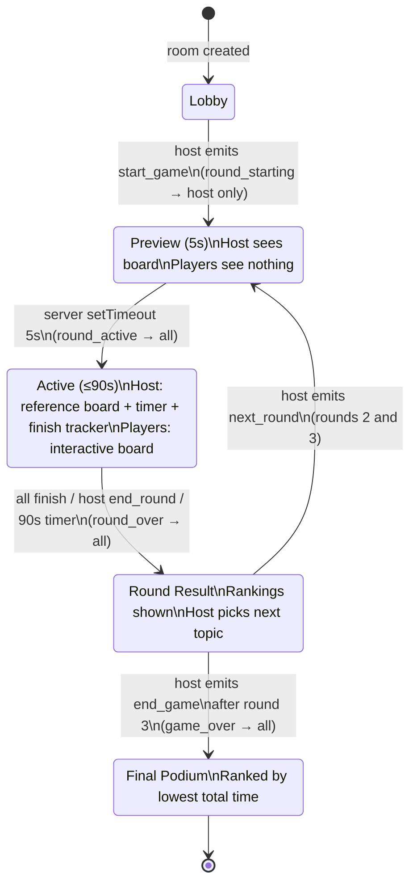
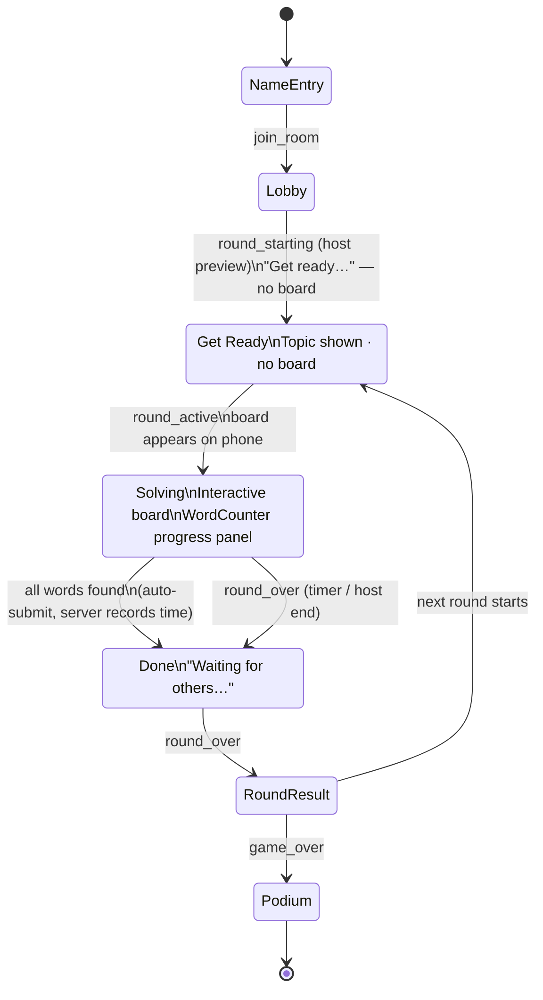
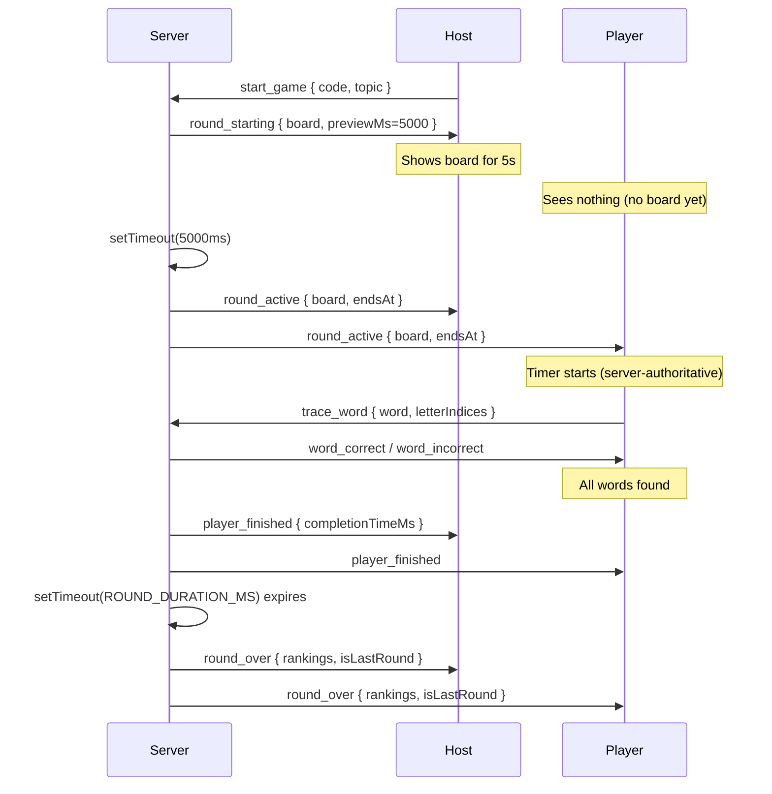

# Game Flow — State Machine

## Host Phase Machine

```mermaid
stateDiagram-v2
    [*] --> Lobby: room created

    Lobby --> Preview: host emits start_game\n(round_starting → host only)
    Preview --> Active: server setTimeout 5s\n(round_active → all)
    Active --> RoundResult: all finish / host end_round / 90s timer\n(round_over → all)
    RoundResult --> Preview: host emits next_round\n(rounds 2 and 3)
    RoundResult --> Podium: host emits end_game\nafter round 3\n(game_over → all)
    Podium --> [*]

    Preview: Preview (5s)\nHost sees board\nPlayers see nothing
    Active: Active (≤90s)\nHost: reference board + timer + finish tracker\nPlayers: interactive board
    RoundResult: Round Result\nRankings shown\nHost picks next topic
    Podium: Final Podium\nRanked by lowest total time
```

## Player Phase Machine

```mermaid
stateDiagram-v2
    [*] --> NameEntry
    NameEntry --> Lobby: join_room

    Lobby --> GetReady: round_starting (host preview)\n"Get ready…" — no board
    GetReady --> Solving: round_active\nboard appears on phone
    Solving --> Done: all words found\n(auto-submit, server records time)
    Solving --> Done: round_over (timer / host end)
    Done --> RoundResult: round_over
    RoundResult --> GetReady: next round starts
    RoundResult --> Podium: game_over
    Podium --> [*]

    GetReady: Get Ready\nTopic shown · no board
    Solving: Solving\nInteractive board\nWordCounter progress panel
    Done: Done\n"Waiting for others…"
```

## Round Timer & Scoring

```mermaid
sequenceDiagram
    participant S as Server
    participant H as Host
    participant P as Player

    H->>S: start_game { code, topic }
    S->>H: round_starting { board, previewMs=5000 }
    Note over H: Shows board for 5s
    Note over P: Sees nothing (no board yet)

    S->>S: setTimeout(5000ms)
    S->>H: round_active { board, endsAt }
    S->>P: round_active { board, endsAt }
    Note over P: Timer starts (server-authoritative)

    P->>S: trace_word { word, letterIndices }
    S->>P: word_correct / word_incorrect

    Note over P: All words found
    S->>H: player_finished { completionTimeMs }
    S->>P: player_finished

    S->>S: setTimeout(ROUND_DURATION_MS) expires
    S->>H: round_over { rankings, isLastRound }
    S->>P: round_over { rankings, isLastRound }
```
