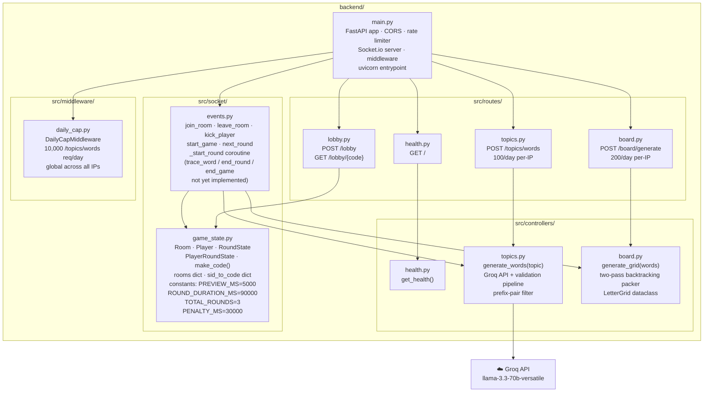
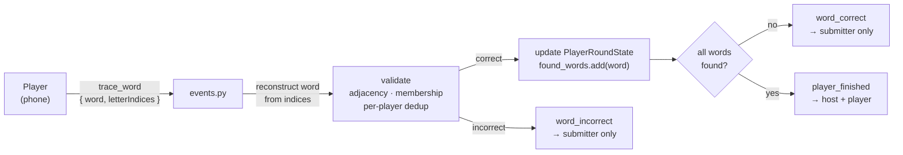
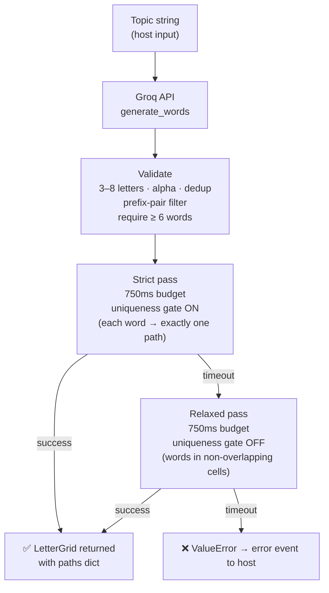

# Module & Component Map

## Backend Modules (Python)

```mermaid
graph TD
    subgraph "backend/"
        MAIN["main.py\nFastAPI app · CORS · rate limiter\nSocket.io server · middleware\nuvicorn entrypoint"]

        subgraph "src/routes/"
            RH["health.py\nGET /"]
            RL["lobby.py\nPOST /lobby\nGET /lobby/{code}"]
            RT["topics.py\nPOST /topics/words\n100/day per-IP"]
            RB["board.py\nPOST /board/generate\n200/day per-IP"]
        end

        subgraph "src/controllers/"
            CH["health.py\nget_health()"]
            CT["topics.py\ngenerate_words(topic)\nGroq API + validation pipeline\nprefix-pair filter"]
            CB["board.py\ngenerate_grid(words)\ntwo-pass backtracking packer\nLetterGrid dataclass"]
        end

        subgraph "src/socket/"
            GS["game_state.py\nRoom · Player · RoundState\nPlayerRoundState · make_code()\nrooms dict · sid_to_code dict\nconstants: PREVIEW_MS=5000\nROUND_DURATION_MS=90000\nTOTAL_ROUNDS=3\nPENALTY_MS=30000"]
            EV["events.py\njoin_room · leave_room · kick_player\nstart_game · next_round\n_start_round coroutine\n(trace_word / end_round / end_game\nnot yet implemented)"]
        end

        subgraph "src/middleware/"
            DC["daily_cap.py\nDailyCapMiddleware\n10,000 /topics/words req/day\nglobal across all IPs"]
        end
    end

    GROQ["☁️ Groq API\nllama-3.3-70b-versatile"]

    MAIN --> RH & RL & RT & RB
    MAIN --> EV
    MAIN --> DC
    RH --> CH
    RL --> GS
    RT --> CT
    RB --> CB
    EV --> GS
    EV --> CT
    EV --> CB
    CT --> GROQ
```

## Frontend Components

```mermaid
graph TD
    subgraph "Host View — /host/[code]"
        HV["HostView.tsx\nphase machine\nkick confirm dialog"]
        HBP["HostBoardPreview.tsx\n5s preview · board left · word list right"]
        LB1["LetterBoard.tsx\ncellSize=lg · grey dead cells"]
        RT["RoundTimer.tsx\ncountdown from endsAt"]
        FT["FinishTracker.tsx\nlive finish list + times"]
        RR["RoundRankings.tsx\nbetween-round table"]
        TSC["TopicSelector.tsx\nfree-text input"]
        PD["Podium.tsx\nfinal 3/2/1 by lowest time"]
        HTP["HowToPlay.tsx\nmodal from lobby"]

        HV --> HBP & RT & FT & RR & TSC & PD & HTP
        HBP --> LB1
        HV --> LB1
    end

    subgraph "Player View — /play/[code]"
        PV["PlayerView.tsx\nphase machine · kicked screen"]
        LB2["LetterBoard.tsx\ncellSize=md"]
        WT["WordTracer.tsx\ndrag-to-trace · SVG stroke overlay\nlocked prop when finished"]
        WC["WordCounter.tsx\nletter-slot boxes sorted short→long\nfills with stroke color on find"]
        PD2["Podium.tsx"]

        PV --> LB2 & WT & WC & PD2
        WT --> LB2
    end

    subgraph "Solo View — /solo"
        SV["SoloView.tsx\ntopic-entry → loading → words-preview\n→ loading → playing → round-result\nclient-side path validation"]
        LB3["LetterBoard.tsx"]
        WT2["WordTracer.tsx"]
        WC2["WordCounter.tsx"]
        SW["useStopwatch.ts\nclient-side timer · 100ms tick"]

        SV --> LB3 & WT2 & WC2 & SW
        WT2 --> LB3
    end

    subgraph "Shared"
        UR["useRoom.ts\nsocket event wiring · all game state\nkicked · foundWordPaths · pendingTraceRef"]
        SP["SocketProvider.tsx\nsingleton socket context\ninitErrorReporter"]
        TY["lib/types.ts\nPlayer · LetterGrid (with paths)\nRoomState · all event payloads"]
        FM["lib/format.ts\nformatMs → '00:21.3'"]
        CFG["lib/config.ts\nBACKEND_URL / WS_URL\nfrom NEXT_PUBLIC_BACKEND_URL"]
    end

    HV --> UR
    PV --> UR
    UR --> SP
    UR --> TY
    RT & FT & RR & PD & PD2 & SV --> FM
    SV & HV --> CFG
```

## Data Flow — `trace_word` (planned)

```mermaid
flowchart LR
    PH["Player\n(phone)"] -->|"trace_word\n{ word, letterIndices }"| EV2["events.py"]
    EV2 -->|"reconstruct word\nfrom indices"| VAL["validate\nadjacency · membership\nper-player dedup"]
    VAL -->|correct| UPD["update PlayerRoundState\nfound_words.add(word)"]
    VAL -->|incorrect| WI["word_incorrect\n→ submitter only"]
    UPD --> DONE{all words\nfound?}
    DONE -->|no| WC2["word_correct\n→ submitter only"]
    DONE -->|yes| PF["player_finished\n→ host + player"]
```

## Data Flow — Board Generation (two-pass)

```mermaid
flowchart TD
    TOPIC["Topic string\n(host input)"] --> GROQ["Groq API\ngenerate_words"]
    GROQ --> VALIDATE["Validate\n3–8 letters · alpha · dedup\nprefix-pair filter\nrequire ≥ 6 words"]
    VALIDATE --> STRICT["Strict pass\n750ms budget\nuniqueness gate ON\n(each word → exactly one path)"]
    STRICT -->|success| BOARD["✅ LetterGrid returned\nwith paths dict"]
    STRICT -->|timeout| RELAXED["Relaxed pass\n750ms budget\nuniqueness gate OFF\n(words in non-overlapping cells)"]
    RELAXED -->|success| BOARD
    RELAXED -->|timeout| ERR["❌ ValueError → error event to host"]
```
