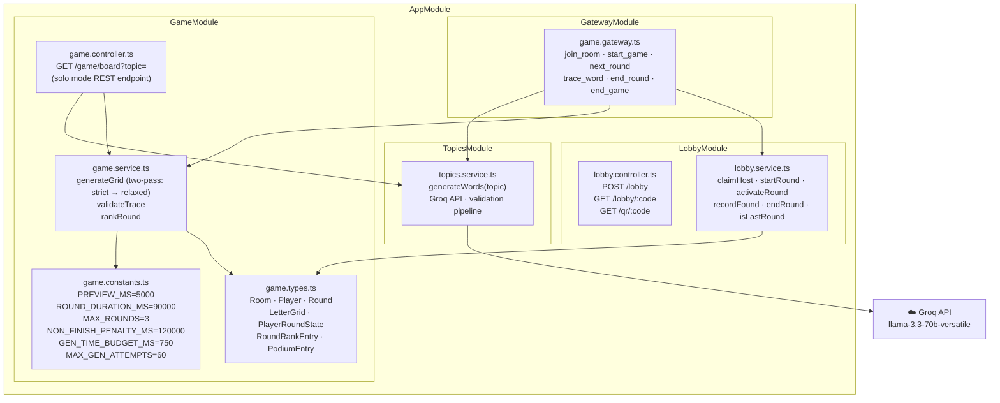
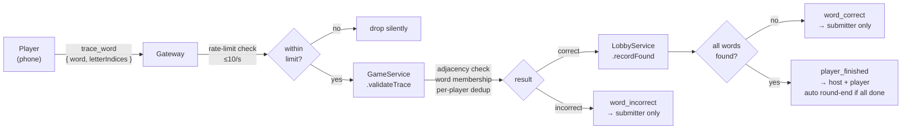
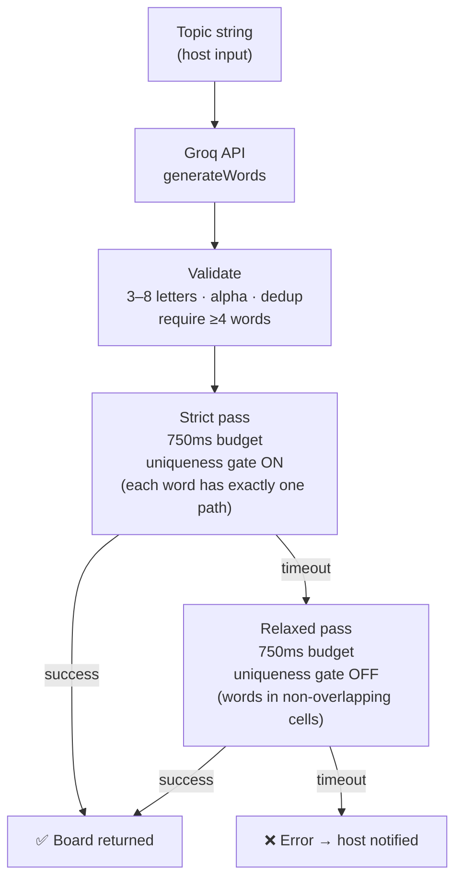

# Module & Component Map

## Backend Modules

```mermaid
graph TD
    subgraph AppModule
        subgraph GatewayModule
            GW["game.gateway.ts\njoin_room · start_game · next_round\ntrace_word · end_round · end_game"]
        end

        subgraph LobbyModule
            LC["lobby.controller.ts\nPOST /lobby\nGET /lobby/:code\nGET /qr/:code"]
            LS["lobby.service.ts\nclaimHost · startRound · activateRound\nrecordFound · endRound · isLastRound"]
        end

        subgraph GameModule
            GC2["game.controller.ts\nGET /game/board?topic=\n(solo mode REST endpoint)"]
            GS["game.service.ts\ngenerateGrid (two-pass: strict → relaxed)\nvalidateTrace\nrankRound"]
            GT["game.types.ts\nRoom · Player · Round\nLetterGrid · PlayerRoundState\nRoundRankEntry · PodiumEntry"]
            GC["game.constants.ts\nPREVIEW_MS=5000\nROUND_DURATION_MS=90000\nMAX_ROUNDS=3\nNON_FINISH_PENALTY_MS=120000\nGEN_TIME_BUDGET_MS=750\nMAX_GEN_ATTEMPTS=60"]
        end

        subgraph TopicsModule
            TS["topics.service.ts\ngenerateWords(topic)\nGroq API · validation pipeline"]
        end
    end

    GROQ["☁️ Groq API\nllama-3.3-70b-versatile"]

    GW --> LS
    GW --> GS
    GW --> TS
    GC2 --> GS
    GC2 --> TS
    TS --> GROQ
    GS --> GT
    GS --> GC
    LS --> GT
```

## Frontend Components

```mermaid
graph TD
    subgraph "Host View — /host/[code]"
        HV["HostView.tsx\nphase machine"]
        HBP["HostBoardPreview.tsx\n5s preview · board left · word list right"]
        LB1["LetterBoard.tsx\ncellSize=lg · grey dead cells"]
        RT["RoundTimer.tsx\ncountdown from endsAt"]
        FT["FinishTracker.tsx\nlive finish list + times"]
        RR["RoundRankings.tsx\nbetween-round table"]
        TSC["TopicSelector.tsx\nfree-text input"]
        PD["Podium.tsx\nfinal 3/2/1 by lowest time"]

        HV --> HBP
        HV --> RT
        HV --> FT
        HV --> RR
        HV --> TSC
        HV --> PD
        HBP --> LB1
        HV --> LB1
    end

    subgraph "Player View — /play/[code]"
        PV["PlayerView.tsx\nphase machine"]
        LB2["LetterBoard.tsx\ncellSize=md"]
        WT["WordTracer.tsx\ndrag-to-trace · SVG stroke overlay\nskips cells without data-idx"]
        WC["WordCounter.tsx\nletter-slot boxes sorted short→long\nfills with stroke color on find"]
        PD2["Podium.tsx"]

        PV --> LB2
        PV --> WT
        PV --> WC
        PV --> PD2
        WT --> LB2
    end

    subgraph "Solo View — /solo"
        SV["SoloView.tsx\nphase machine\ntopic-entry → loading → playing → round-result"]
        LB3["LetterBoard.tsx"]
        WT2["WordTracer.tsx"]
        WC2["WordCounter.tsx"]
        SW["useStopwatch.ts\nclient-side timer · 100ms tick"]

        SV --> LB3
        SV --> WT2
        SV --> WC2
        SV --> SW
        WT2 --> LB3
    end

    subgraph "Shared"
        UR["useRoom.ts\nsocket state\nround_starting → round_active\n→ round_over → game_over"]
        TY["lib/types.ts\nfrontend mirror of game.types.ts"]
        FM["lib/format.ts\nformatMs → '00:21.3'"]
        CFG["lib/config.ts\nBACKEND_URL"]
    end

    HV --> UR
    PV --> UR
    UR --> TY
    RT --> FM
    FT --> FM
    RR --> FM
    PD --> FM
    PD2 --> FM
    SV --> FM
    SV --> CFG
```

## Data Flow — `trace_word`

```mermaid
flowchart LR
    PH["Player\n(phone)"] -->|"trace_word\n{ word, letterIndices }"| GW2["Gateway"]
    GW2 -->|"rate-limit check\n≤10/s"| RL{within\nlimit?}
    RL -->|no| DROP["drop silently"]
    RL -->|yes| VAL["GameService\n.validateTrace"]
    VAL -->|"adjacency check\nword membership\nper-player dedup"| RES{result}
    RES -->|correct| RF["LobbyService\n.recordFound"]
    RES -->|incorrect| WI2["word_incorrect\n→ submitter only"]
    RF --> DONE{all words\nfound?}
    DONE -->|no| WC2["word_correct\n→ submitter only"]
    DONE -->|yes| PF2["player_finished\n→ host + player\nauto round-end if all done"]
```

## Data Flow — Board Generation (two-pass)

```mermaid
flowchart TD
    TOPIC["Topic string\n(host input)"] --> GROQ["Groq API\ngenerateWords"]
    GROQ --> VALIDATE["Validate\n3–8 letters · alpha · dedup\nrequire ≥4 words"]
    VALIDATE --> STRICT["Strict pass\n750ms budget\nuniqueness gate ON\n(each word has exactly one path)"]
    STRICT -->|success| BOARD["✅ Board returned"]
    STRICT -->|timeout| RELAXED["Relaxed pass\n750ms budget\nuniqueness gate OFF\n(words in non-overlapping cells)"]
    RELAXED -->|success| BOARD
    RELAXED -->|timeout| ERR["❌ Error → host notified"]
```
