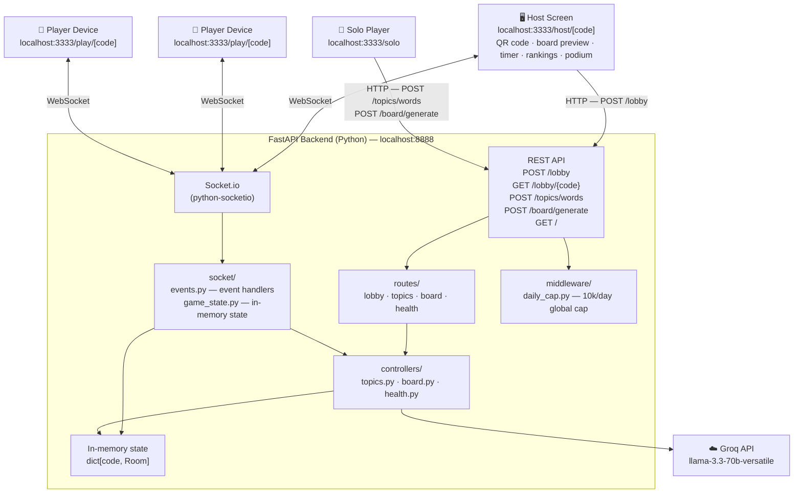

# System Overview

```mermaid
graph TD
    HOST["🖥️ Host Screen\nlocalhost:3333/host/[code]\nQR code · board preview · timer · rankings · podium"]
    PLAYER1["📱 Player Device\nlocalhost:3333/play/[code]"]
    PLAYER2["📱 Player Device\nlocalhost:3333/play/[code]"]
    SOLO["📱 Solo Player\nlocalhost:3333/solo"]

    subgraph BACKEND["FastAPI Backend (Python) — localhost:8888"]
        REST["REST API\nPOST /lobby\nGET /lobby/{code}\nPOST /topics/words\nPOST /board/generate\nGET /"]
        WS["Socket.io\n(python-socketio)"]
        ROUTES["routes/\nlobby · topics · board · health"]
        CONTROLLERS["controllers/\ntopics.py · board.py · health.py"]
        SOCKET["socket/\nevents.py — event handlers\ngame_state.py — in-memory state"]
        MW["middleware/\ndaily_cap.py — 10k/day global cap"]
        STATE["In-memory state\ndict[code, Room]"]
    end

    GROQ["☁️ Groq API\nllama-3.3-70b-versatile"]

    HOST -->|"HTTP — POST /lobby"| REST
    HOST <-->|"WebSocket"| WS
    PLAYER1 <-->|"WebSocket"| WS
    PLAYER2 <-->|"WebSocket"| WS
    SOLO -->|"HTTP — POST /topics/words\nPOST /board/generate"| REST

    REST --> ROUTES
    ROUTES --> CONTROLLERS
    WS --> SOCKET
    SOCKET --> STATE
    CONTROLLERS --> STATE
    CONTROLLERS --> GROQ
    SOCKET --> CONTROLLERS
    REST --> MW
```
