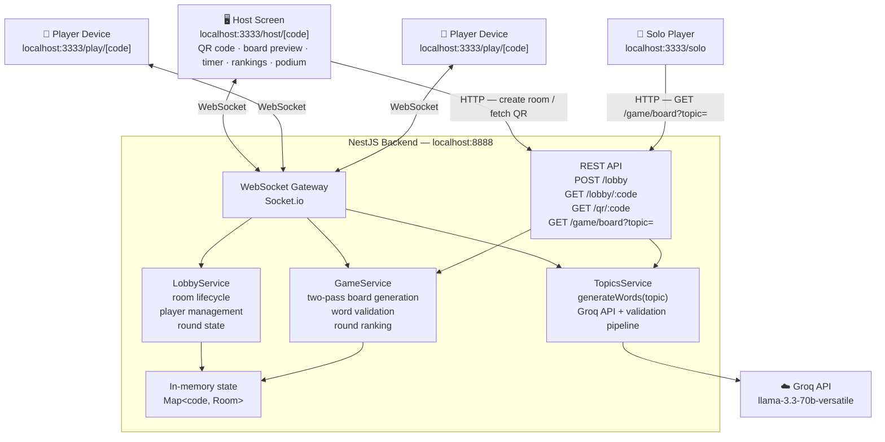

# System Overview

```mermaid
graph TD
    HOST["🖥️ Host Screen\nlocalhost:3333/host/[code]\nQR code · board preview · timer · rankings · podium"]
    PLAYER1["📱 Player Device\nlocalhost:3333/play/[code]"]
    PLAYER2["📱 Player Device\nlocalhost:3333/play/[code]"]
    SOLO["📱 Solo Player\nlocalhost:3333/solo"]

    subgraph BACKEND["NestJS Backend — localhost:8888"]
        REST["REST API\nPOST /lobby\nGET /lobby/:code\nGET /qr/:code\nGET /game/board?topic="]
        WS["WebSocket Gateway\nSocket.io"]
        LOBBY["LobbyService\nroom lifecycle\nplayer management\nround state"]
        GAME["GameService\ntwo-pass board generation\nword validation\nround ranking"]
        TOPICS["TopicsService\ngenerateWords(topic)\nGroq API + validation pipeline"]
        STATE["In-memory state\nMap&lt;code, Room&gt;"]
    end

    GROQ["☁️ Groq API\nllama-3.3-70b-versatile"]

    HOST -->|"HTTP — create room / fetch QR"| REST
    HOST <-->|"WebSocket"| WS
    PLAYER1 <-->|"WebSocket"| WS
    PLAYER2 <-->|"WebSocket"| WS
    SOLO -->|"HTTP — GET /game/board?topic="| REST

    WS --> LOBBY
    WS --> GAME
    WS --> TOPICS
    REST --> TOPICS
    REST --> GAME
    LOBBY --> STATE
    GAME --> STATE
    TOPICS --> GROQ
```
