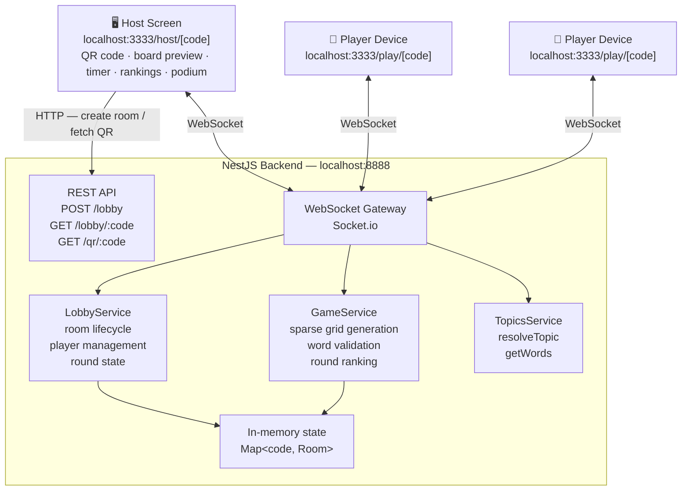

# System Overview

```mermaid
graph TD
    HOST["🖥️ Host Screen\nlocalhost:3333/host/[code]\nQR code · board preview · timer · rankings · podium"]
    PLAYER1["📱 Player Device\nlocalhost:3333/play/[code]"]
    PLAYER2["📱 Player Device\nlocalhost:3333/play/[code]"]

    subgraph BACKEND["NestJS Backend — localhost:8888"]
        REST["REST API\nPOST /lobby\nGET /lobby/:code\nGET /qr/:code"]
        WS["WebSocket Gateway\nSocket.io"]
        LOBBY["LobbyService\nroom lifecycle\nplayer management\nround state"]
        GAME["GameService\nsparse grid generation\nword validation\nround ranking"]
        TOPICS["TopicsService\nresolveTopic\ngetWords"]
        STATE["In-memory state\nMap&lt;code, Room&gt;"]
    end

    HOST -->|"HTTP — create room / fetch QR"| REST
    HOST <-->|"WebSocket"| WS
    PLAYER1 <-->|"WebSocket"| WS
    PLAYER2 <-->|"WebSocket"| WS

    WS --> LOBBY
    WS --> GAME
    WS --> TOPICS
    LOBBY --> STATE
    GAME --> STATE
```
