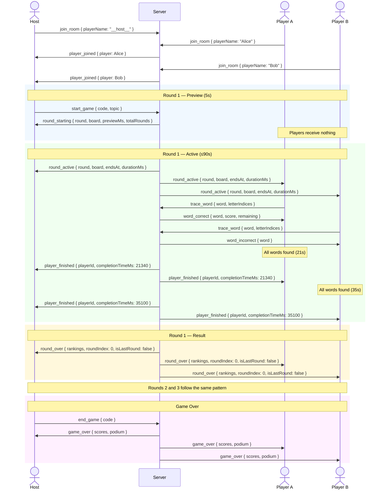
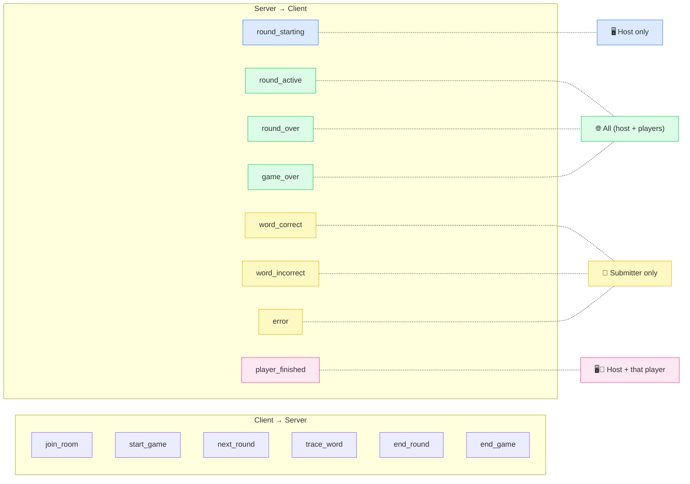

# WebSocket Event Flow

## Full Round Sequence (two players)

```mermaid
sequenceDiagram
    actor Host
    participant S as Server
    actor A as Player A
    actor B as Player B

    Host->>S: join_room { playerName: "__host__" }
    A->>S: join_room { playerName: "Alice" }
    S->>Host: player_joined { player: Alice }
    B->>S: join_room { playerName: "Bob" }
    S->>Host: player_joined { player: Bob }

    rect rgb(240, 248, 255)
        Note over Host,B: Round 1 — Preview (5s)
        Host->>S: start_game { code, topic }
        S->>Host: round_starting { round, board, previewMs, totalRounds }
        Note over A,B: Players receive nothing
    end

    rect rgb(240, 255, 240)
        Note over Host,B: Round 1 — Active (≤90s)
        S->>Host: round_active { round, board, endsAt, durationMs }
        S->>A: round_active { round, board, endsAt, durationMs }
        S->>B: round_active { round, board, endsAt, durationMs }

        A->>S: trace_word { word, letterIndices }
        S->>A: word_correct { word, score, remaining }

        B->>S: trace_word { word, letterIndices }
        S->>B: word_incorrect { word }

        Note over A: All words found (21s)
        S->>Host: player_finished { playerId, completionTimeMs: 21340 }
        S->>A: player_finished { playerId, completionTimeMs: 21340 }

        Note over B: All words found (35s)
        S->>Host: player_finished { playerId, completionTimeMs: 35100 }
        S->>B: player_finished { playerId, completionTimeMs: 35100 }
    end

    rect rgb(255, 248, 220)
        Note over Host,B: Round 1 — Result
        S->>Host: round_over { rankings, roundIndex: 0, isLastRound: false }
        S->>A: round_over { rankings, roundIndex: 0, isLastRound: false }
        S->>B: round_over { rankings, roundIndex: 0, isLastRound: false }
    end

    Note over Host,B: Rounds 2 and 3 follow the same pattern

    rect rgb(255, 240, 255)
        Note over Host,B: Game Over
        Host->>S: end_game { code }
        S->>Host: game_over { scores, podium }
        S->>A: game_over { scores, podium }
        S->>B: game_over { scores, podium }
    end
```

## Event Audiences

```mermaid
graph LR
    subgraph "Client → Server"
        JR[join_room]
        SG[start_game]
        NR[next_round]
        TW[trace_word]
        ER[end_round]
        EG[end_game]
    end

    subgraph "Server → Client"
        RS[round_starting]:::hostonly
        RA[round_active]:::allplayers
        WC[word_correct]:::submitter
        WI[word_incorrect]:::submitter
        PF[player_finished]:::hostandplayer
        RO[round_over]:::allplayers
        GO[game_over]:::allplayers
        ERR[error]:::submitter
    end

    classDef hostonly fill:#dbeafe,stroke:#3b82f6
    classDef allplayers fill:#dcfce7,stroke:#22c55e
    classDef submitter fill:#fef9c3,stroke:#eab308
    classDef hostandplayer fill:#fce7f3,stroke:#ec4899

    RS -.- HL["🖥️ Host only"]:::hostonly
    RA -.- AL["🌐 All (host + players)"]:::allplayers
    WC -.- SL["👤 Submitter only"]:::submitter
    WI -.- SL
    ERR -.- SL
    PF -.- HL2["🖥️👤 Host + that player"]:::hostandplayer
    RO -.- AL
    GO -.- AL
```
